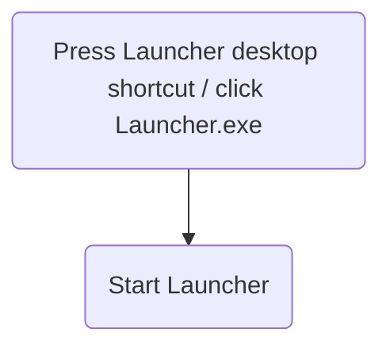

List of non-game components:

| Component name  | Purpose |
| ------------- | ------------- |
| ServerGameVersionProvider  | This server has only one purpose: it provides the client version number to the user. Its intended use is that the launcher can ask for the version number, then download that version.  |
| ClientLauncher  | This component is what the player downloads explicitly. It has a simple UI, with a button: check version. When clicked this turns either into "play" or "update". "update" downloads the matching version from github as a zip, then turns into "play". Does not require login.|
| ServerGameDatabase  | This server stores all player data and other changing data in a database, for example sqlite. it is not accessible to clients directly, all requests shall come from other Server components.  |
| ServerLoginQueue  | This server is the entry point when a player wants to login. It has a queue where a new login attempt is inserted into. It is in contact with the ServerSessionManagers, which tell how many more sesions they can handle, and distributes among them. Once through the queue, the server tells the IP of the SessionManager to the client and disconnects|
| ServerSessionManagers  | This server is the manages the connection to the client. It has a fixed capacity, e.g. 1000 sessions, so it does not get overwhelmed. It can interact with the ServerGameDatabase to get character data, and other ServerSessionManagers in case synchronization is needed. It might be that multiple instances are responsible for different levels, then a take-over when switching will be done |

Flowchart for the Launcher. This minimalistic launcher does not support partial updates, it retrieves the entire game on update.
It can be phased out once a game is released on steam or another distribution platform, which would then handle the updates.

